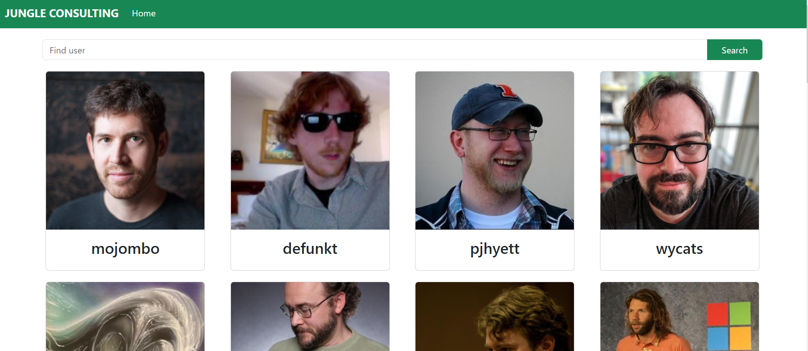

# JungleConsulting

Цей веб-додаток було створено у рамках виконання тестового завдання компанії Jungle Consulting. Він дозволяє отримати базову інформацію про юзерів платформи GitHub та їх публічні репозиторії. Додаток виконано за допомогою фреймворку Angular, для стилізації використано бібліотеку Bootstrap.

## Структура додатку

### Головна сторінка

На головній сторінці додатку наведено список юзерів платформи GitHub. Інформацію про кожного юзера представлено у вигляді картки, що містить фото та нікнейм юзера.

Над списком юзерів розташовано поле пошуку, що дозволяє знайти користувачів платформи за допомогою нікнейма.



У випадку, якщо юзера не зареєстровано на платформі, на полем пошуку з'явиться відповідне попередження жовтого кольору. Також при виникненні помилок зв'язку з сервером, над полем пошуку з'явиться сповіщення червоного кольору з інформацією про помилку.


### Репозиторії

При кліку на картку юзера користувача буде перенаправдено на сторінку, що містить список публічних репозиторіїв обраного юзера.


Кожен репозиторій представлено карткою, що містить назву репозиторію, його опис, та кнопку Details, що відкриває модальне вікно з детальною інформацією про репозиторій.


### Сторінка 404

У випадку введення у адресну строку хибного шляху, користувача буде перенаправдено на сторінку 404, де розміщено кнопку для зручного переходу на домашню сторінку додатку.


## Запуск у режимі розробки і білд продакшн-версії проєкту

Для запуску проєкту у режимі розробки склонуйте даний репозиторій на свій PC, встановіть Noge.js та Angular CLI ([детальніше](https://angular.io/guide/setup-local)), та запустіть у терміналі команду `ng serve`. Запущений проєкт можна буде переглянути за адресою `http://localhost:4200/`. Додаток автоматично перезавантажиться при зміні будь-якого із вихідних файлів.

Для створення продакшн версії проєкту запустіть у терміналі команду `ng build`. Готовий проєкт буде зібрано у папці `dist/jungle-consulting`.

## Деплой проєкту

[Ознайомчу версію проєкту](https://graceful-klepon-d2c83a.netlify.app) викладено на сервері Netlify. Доступ до неї можна отримати за посиланням:

```javascript
"https://graceful-klepon-d2c83a.netlify.app";
```

## Використані технології

Під час роботи над проєктом було використано наступний стек тенологій:

<code></code>
<code></code>
<code></code>
<code></code>
<code></code>
<code></code>
<code></code>
<code></code>
<code></code>
<code></code>
<code></code>
